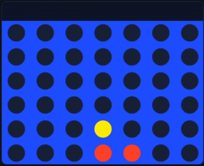

# Connect 4 AI (CNN + Transformer)

Course project for **RM294 — Spring 2026**.

This project delivers a production-style Connect 4 system with a browser UI, cloud inference backend, and a full training pipeline for policy models. The deployed application supports two model backends: a residual CNN (`cnn2`, default) and a Transformer policy model.

**Try Live:** [Launch the app](https://msba25optim2-group30.anvil.app/)

## System Overview

- **Frontend**: Anvil-based app with authentication, gameplay loop, and model selection.
- **Backend**: AWS/Lightsail Uplink service exposing `get_ai_move` and `check_winner_server`.
- **Model serving**: Runtime loads trained `.keras` checkpoints and applies legal-move constraints before returning a move.
- **Data logging**: Gameplay and generation outputs are persisted as JSONL for analysis and targeted fine-tuning.

## Training Pipeline

Primary notebooks:
- `training/Connect4_CNN_Transformer_Training.ipynb`
- `training/Connect4_CNN_Only_Training.ipynb`
- `training/Connect4_CNN2_Loss_Finetune_Colab.ipynb`

### Dataset and Input Representation

- Main supervised dataset: `datasets/connect4_combined_unique.npz`
- Executed split used in training: **Train 636,100 / Val 79,512 / Test 79,512**
- Input tensor: `(6, 7, 2)` board state
- Target: 7-way policy classification (column index `0-6`)

### Data Pipeline and Augmentation

- `tf.data` pipeline with shuffle (`20,000` buffer), batching, and `prefetch(tf.data.AUTOTUNE)`
- Training augmentation: horizontal flip with probability `0.5`, with consistent label remap `y = 6 - y`
- Validation/test: one-hot encoding only (no augmentation)

### Optimization Strategy

- `BATCH_SIZE = 256`
- `INIT_LR = 1e-3`, `FINETUNE_LR = 1e-5`
- `EPOCHS_PHASE1 = 60`, conditional `EPOCHS_FINETUNE = 10`
- `TARGET_VAL_ACC = 0.72`, `EARLY_STOP_PATIENCE = 10`
- Warmup + cosine learning-rate schedule (`WARMUP_EPOCHS = 3`)
- Mixed precision enabled (`mixed_float16`)

### CNN Model (Default)

- Residual CNN on `(6, 7, 2)` input with a convolutional stem and **10 residual blocks**
- BatchNorm/ReLU stack, global average pooling, dense head, and dropout
- Loss: categorical cross-entropy with label smoothing (`0.05`)
- Metrics include accuracy and top-2 accuracy
- Two-phase training: best checkpoint save, then low-LR fine-tune if validation target is not reached
- Observed run metrics: ~**0.651** validation accuracy and ~**0.649** test accuracy

### Transformer Model

- Board-token Transformer in the same training flow:
  - board flattened to 42 tokens and projected via `BoardPatchEmbedding`
  - sinusoidal positional encoding
  - **8 pre-LN transformer blocks** (`EMBED_DIM = 256`, `NUM_HEADS = 8`, `FF_DIM = 512`)
- Classification head: global average pooling + dense projection to 7-way softmax
- Same scheduler/callback and two-phase fine-tune policy as CNN
- Observed run metrics: ~**0.572** validation accuracy and ~**0.573** test accuracy

### Targeted CNN Loss-Correction Fine-Tune

- `training/Connect4_CNN2_Loss_Finetune_Colab.ipynb` fine-tunes saved CNN checkpoints on game-log correction data (`finetune_loss_cnn2_teacher*.npz`)
- Typical settings: `BATCH_SIZE = 128`, `EPOCHS = 28`, `LEARNING_RATE = 2e-5`
- Uses `EarlyStopping` and `ReduceLROnPlateau`

## Inference Flow

1. User move is submitted through the Anvil app.
2. Uplink backend receives board state and active model selection.
3. Model inference returns policy scores.
4. Backend applies legal-move filtering and returns a valid move.
5. Optional logs are written for post-hoc evaluation and further fine-tuning.

## Deployment (Summary)

1. Enable Uplink in Anvil and obtain the Uplink key.
2. Upload `aws-deploy/` and model artifacts to the Lightsail instance.
3. Configure `ANVIL_UPLINK_KEY` and model paths in `aws-deploy/server.py`.
4. Start services:
   - `docker-compose build`
   - `docker-compose up -d`
   - `docker-compose logs -f`
5. Verify Uplink connectivity and end-to-end move generation from the UI.

If using the published Anvil URL, ensure Uplink routing is set to the published environment (or enable cross-environment server-call routing to the active Uplink).

## Links

- **Anvil app (published)**: https://msba25optim2-group30.anvil.app/
- **Anvil app clone**: https://anvil.works/build#clone:ZYMBBJME4FOBYPVB=MRHPAQMRQHGS5L7UHINHPSFB

## Repository Structure

- `anvil-files/` - Anvil app source (client/server modules and UI assets)
- `aws-deploy/` - Dockerized Uplink backend and deployment config
- `training/` - Model training and fine-tuning notebooks
- `dataset_generators/` - Data generation and preprocessing utilities
- `assets/` - Project/report assets
- `assetsForReadme/` - README images and gameplay GIF
- `FilesOnLightsail/` - Snapshot of files staged on Lightsail

## Notes

- `cnn2` is the active CNN model path used by the UI by default.
- Transformer inference is available as an alternative model option.
- Authentication supports open email/password signup and Google sign-in for public access.
